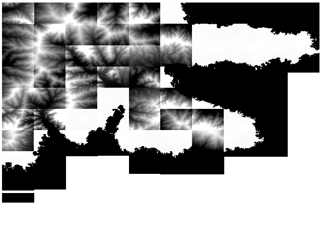
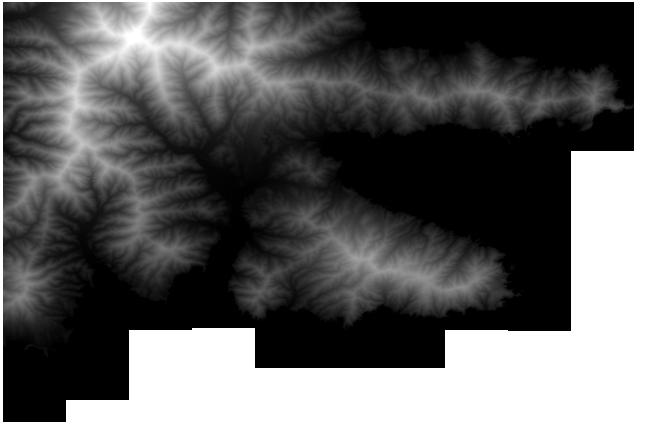
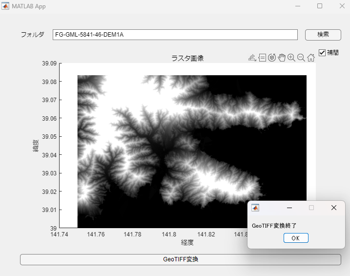

File Exchangeと連携しました。

[](https://jp.mathworks.com/matlabcentral/fileexchange/156976-dem2geotiff_convert)

# <span style="color:rgb(213,80,0)">MATLABによる標高データ活用</span>
# はじめに

本件は[国土地理院の数値標高モデル](https://fgd.gsi.go.jp/download/menu.php)からDEMデータを取得し、それを1枚のGeoTiff画像に変換する物です。


EPSGコードなどが違うので他国のデータに応用する場合は注意が必要となります。


サンプルとして国土地理院のDEMデータを抜粋していますが規約に反する場合は消去します。

# 概要と必要なToolbox
## DEMデータをGeoTiffに変換する

ここではDEMデータ(3次メッシュ情報)を1枚ずつGeoTiff変換しています。

<p style="text-align:left"></p>


**GeoTIFF_Convert.mlx**

```matlab
[~, pList] = matlab.codetools.requiredFilesAndProducts('GeoTIFF_Convert.mlx');
Tbox = string({pList.Name}');
Certain = cell2mat({pList.Certain}');

disp(Tbox(Certain))
```

```TextOutput
    "MATLAB"
    "Mapping Toolbox"
    "Parallel Computing Toolbox"
```

## 個々のGeoTiffファイル群を1枚に結合する

3次メッシュを2次メッシュとして1枚のGeoTiffファイルに結合するものです。


ここでも他国のデータを使うときはEPSGコード等の調整が必要です。

<p style="text-align:left"></p>


**GeoTIFF_Merge.mlx**

```matlab
[~, pList] = matlab.codetools.requiredFilesAndProducts('GeoTIFF_Merge.mlx');
Tbox = string({pList.Name}');
Certain = cell2mat({pList.Certain}');

disp(Tbox(Certain))
```

```TextOutput
    "MATLAB"
    "Mapping Toolbox"
```

## アプリ

上記２つを組み合わせてアプリ化したものです。


waitbarをつけているため並列計算しておらず挙動は遅いので要注意です。

<p style="text-align:left"></p>


**GeoTiff.mlapp**

```matlab
[~, pList] = matlab.codetools.requiredFilesAndProducts('GeoTiff.mlapp');
Tbox = string({pList.Name}');
Certain = cell2mat({pList.Certain}');

disp(Tbox(Certain))
```

```TextOutput
    "MATLAB"
    "Mapping Toolbox"
```

# そのほか

mdファイル作成は以下のコードを使っています。

```matlab
% export("README.mlx","README.md",EmbedImages=false, FigureFormat='png', Run=true);
```
